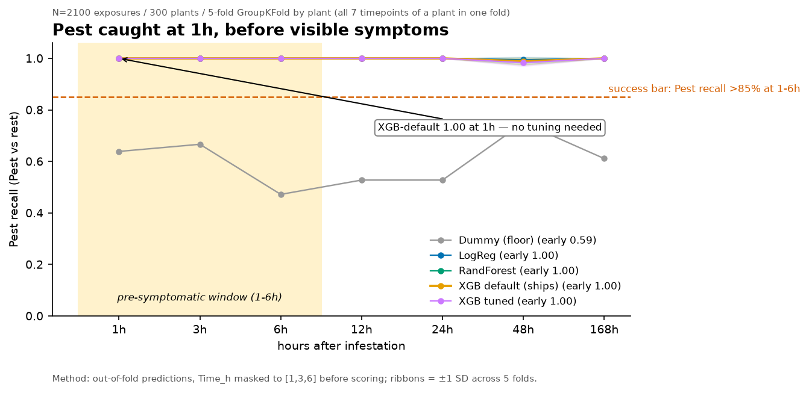
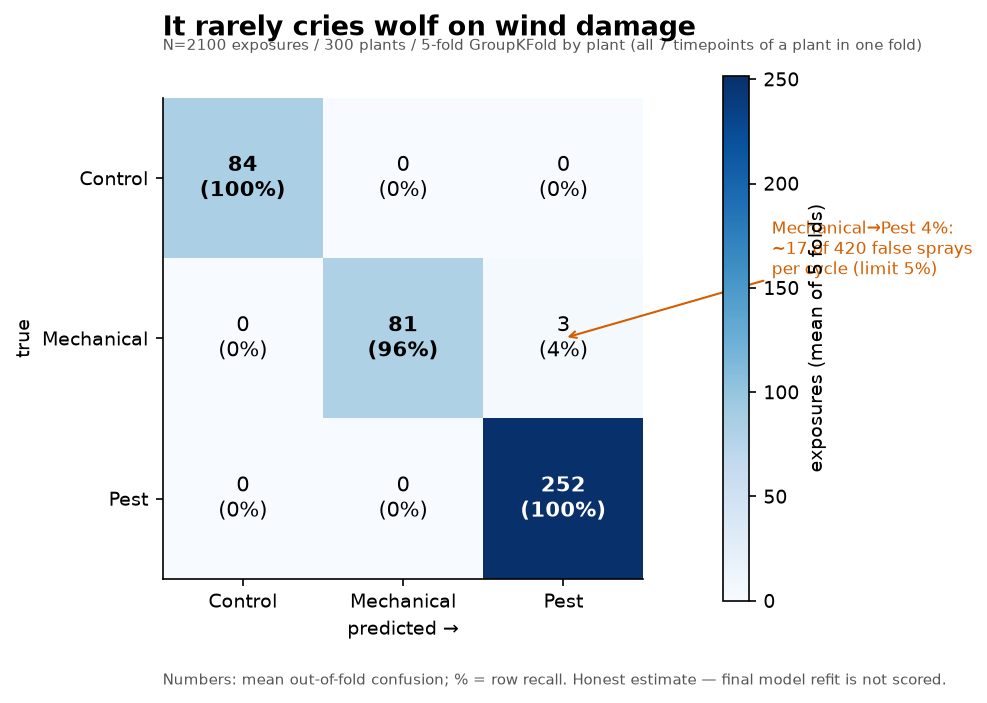
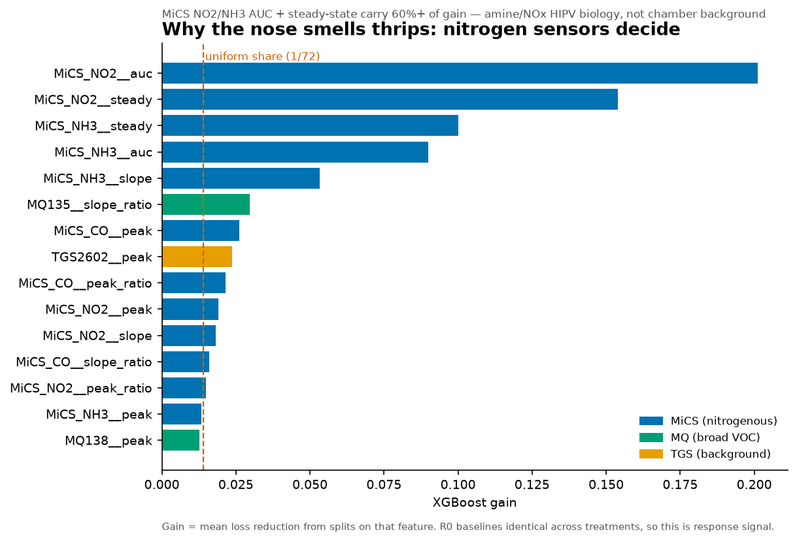

# CropPestDetection — tomato thrips e-nose

Longitudinal e-nose: 2100 exposures (5 treatments x 7 Time_h x 60 reps), 300 plants.
`plant_id = Treatment_Replicate`. Per exposure: baseline 30s / acquisition 120s / recovery 60s @0.1s.

## Data engineering (done)
- `src/ingestion.py` — chunked `iter_samples_csv` + `UniversalSensorLoader` (CSV-replay = live-IoT schema)
- `src/features.py` — per-SampleID R0 median -> dR/R0 -> Peak/AUC/Slope/SteadyState + array-ratio + recovery QA
- `src/splits.py` — stratified GroupKFold by `plant_id`, zero plant leakage
- `scripts/make_features.py` — full build: `python scripts/make_features.py --input <csv> --output processed/features.parquet`
- Kaggle: see `scripts/kaggle_setup.md`; code in GitHub, 880MB CSV as private Kaggle Dataset only.

## Labels
Head-1 `y_L1`: Control / Mechanical / Pest. Head-2 `y_L2` (pest only): Low / Medium / High.
`advisory/` maps predictions -> IPM actions (Shinde KB, deterministic, no training).

## Training (to be done, CPU-only, plant-grouped 5-fold)
- Head-1 champion `xgb_default`: early (1h-6h) Pest recall **1.00**, Mechanical->Pest **0.04**. Gate (0.85 / 0.05) **PASS**. Tuning added nothing at ceiling.
- Head-2 severity acc 0.66: 1h 0.53 / 3h 0.64 / 6h 0.42 / 12h 0.53 / 24h 0.83 / 48h 0.80 / 168h 0.87 — early weakness expected, late resolve.
- Top drivers: MiCS_NO2/NH3 AUC + steady-state (nitrogenous HIPV pathway).
- Artifacts: `models/head1_xgb.json`, `models/head2_xgb.json`, `models/feature_list.json` (72, no scaler — trees scale-invariant). Honest metrics: `reports/final_metrics.json` (OOF, not refit).
- Leakage checks: R0 baselines identical across treatments; zero plant overlap (`scripts/leak_check.py`).

## Inference (done, RPi-ready)
- `src/predict.py` — `Predictor().predict_live(readings, meta)` for greenhouse use; `predict_csv_sample()` for replay. Cycle: 30s baseline + 120s acquisition + 60s recovery @10Hz. Verified: live dict path == CSV path; 60/60 replay correct.
- `notebooks/05_inference.ipynb` — field template.

## Results (gate PASS, XGB defaults ship)

*Early recall 1.00 at 1–6h for every real model; dummy 0.59.*

*Mechanical→Pest 4% (limit 5%); Control and Pest rows perfect.*

*MiCS NO2/NH3 AUC + steady-state carry 60%+ of gain.*

Full set: `reports/figures/` (`head2_time_curve.png`, `ceiling_bars.png`), viewer `notebooks/06_results.ipynb`, rebuild `python src/plots.py`.
